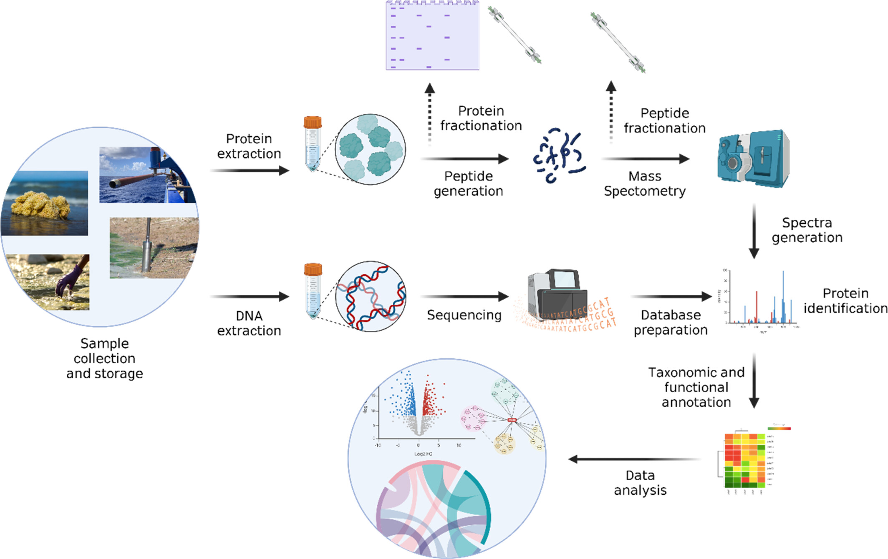
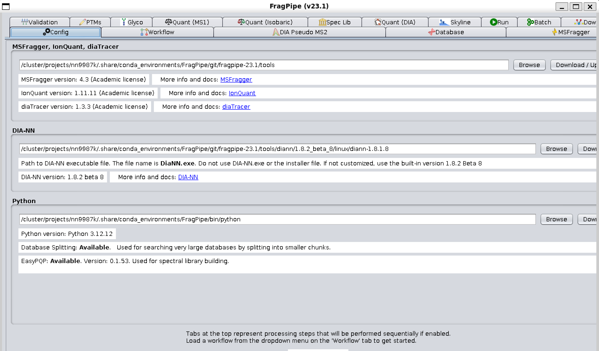



<link rel="stylesheet" href="assets/css/callouts.css">

# Functional omics (Metaproteomics)

## Clasic environmental metaproteomics protocols.



## FragPipe: Proteomics quantification.

What is [FragPipe](https://github.com/Nesvilab/FragPipe): *"FragPipe is a comprehensive computational platform designed for the analysis of mass spectrometry-based proteomics data. It includes a Graphical User Interface and pipeline wrapper code (FragPipe-GUI), distributed alongside various independent software tools and workflow files. FragPipe can be run using GUI or in the command line mode, on Windows, Linux, or in the cloud environment. It is powered by MSFragger - an ultrafast proteomic search engine suitable for both conventional and "open" (wide precursor mass tolerance) peptide identification."*  

### Using FragPipe in SAGA:

To use the FragPipe GUI for configuration we should login SAGA activating the X11 (graphics) by the following command:

```bash
ssh -YX auve@saga.sigma2.no
```

<div class="callout callout-important">
  <div class="callout-title">⚠️ Important</div>
  FragPipe GUI can only run in the login-node
</div>

Then activate the conda environment:

```bash
module load Anaconda3/2022.10
eval "$(conda shell.bash hook)"
conda activate /cluster/projects/nn9987k/.share/conda_environments/FragPipe/
```
Then run the fragPipe

```
fragpipe
```

The following will be displayed:




## Running FragPipe in Headless mode (idealy for HPC)

### Preparing Files: 

Let's run FragPipe in CLI to check and understand what is happening in each step.

1) As this process will take some time, the best is to run everything in a interactive virtual terminal to keep our job alive. So let's ask for a [TMUX](https://github.com/tmux/tmux/wiki) session:

```bash
tmux new -s FRAGPIPE
```

<div class="callout callout-important">
  <div class="callout-title">⚠️ Important</div>
  The TMUX virtual terminal will be running in the login node you are connected not in others.
</div>

2) Ask for an interactive Job

```bash
bash /cluster/projects/nn9987k/UiO_BW_2025/HPC101/SLURM/srun.prarameters.Nonode.Account.sh 14 88G normal,bigmem,hugemem 120G nn9987k 08:00:00
```

<div class="callout callout-warning">
  <div class="callout-title">🚨 Warning</div>
  Running FragPipe requires a lot of resources (RAM and CPUs) plan accordingly
</div>


3) Copy the TimsTOF files (.d) and the database to the $LOCALSCRATCH

```bash
cd $LOCALSCRATCH
rsync -aPhLv /cluster/projects/nn9987k/UiO_BW_2025/metaP/ToyData/TimsTOFData .
rsync -aPhLv /cluster/projects/nn9987k/UiO_BW_2025/metaP/ToyData/Database .
```

We should end with something like: 

<div style="background:#f3f3f3; padding:12px 16px; border-left:6px solid #34db66ff; border-radius:6px;">
<b>💻 Console output:</b>

<pre><code>


tree -d -L 2
.
├── Database
└── TimsTOFData
    ├── 20220302_B10_Slot1-22_1_1607.d
    ├── 20220302_B2_Slot1-14_1_1599.d
    └── 20220302_B4_Slot1-16_1_1601.d

6 directories


</code></pre>
</div>

4) FragPipe require a ["Experimental Manifest"](https://fragpipe.nesvilab.org/docs/tutorial_fragpipe.html) where the .d files are correlated with a experimental type, replicates and so:


```bash
rsync -aPLhv /cluster/projects/nn9987k/UiO_BW_2025/metaP/ToyData/ManifestCtr.tsv .
```

It looks like this:

<div style="background:#f3f3f3; padding:12px 16px; border-left:6px solid #34db66ff; border-radius:6px;">
<b>💻 Console output:</b>

<pre><code>

20220302_B10_Slot1-22_1_1607.d  Ctr     1
20220302_B2_Slot1-14_1_1599.d   Ctr     2
20220302_B4_Slot1-16_1_1601.d   Ctr     3

</code></pre>
</div>


5) Activate the conda environment:

```bash
module load Anaconda3/2022.10
eval "$(conda shell.bash hook)"
conda activate /cluster/projects/nn9987k/.share/conda_environments/FragPipe/

```

### Running configuration of Database and manifests:

Before running FragPipe in Headlss mode the database and workflow should be modify:

Modify the database adding decoys with Philosopher:

```bash
cd $LOCALSCRATCH
echo "Preparing workspace ..."

time philosopher workspace \
--nocheck \
--clean


time philosopher workspace \
--nocheck \
--init
```


Then add decoys to the database:

```bash

time philosopher database \
--custom Database/MGA.v.1.0.S.salar.STX.total.prot.faa \
--contam

```

We can compare the number of sequences in the DB before and after adding decoys:

```bash
DB="Database/MGA.v.1.0.S.salar.STX.total.prot.faa"

# Count sequences in original DB
seqs=$(grep -c "^>" "$DB")
echo "Original DB: $seqs sequences"

# Your modified database (.fas)
datamod=$(ls *.fas)
seqsfas=$(grep -c "^>" "$datamod")
echo "Modified DB: $seqsfas sequences"

# Difference (new sequences added)
added=$(( seqsfas - seqs ))
echo "Number of sequences added: $added"

```

<div style="background:#f3f3f3; padding:12px 16px; border-left:6px solid #34db66ff; border-radius:6px;">
<b>💻 Console output:</b>

<pre><code>


Original DB: 430759 sequences
Modified DB: 861754 sequences
Number of sequences added: 430995

</code></pre>
</div>


Now we can clean the workspace:

```bash
Cleaning workspace

echo "Cleaning workspace..."

time philosopher workspace \
--nocheck \
--clean
```

### Modifying the Workflow:

Fragpipe needs that the information on where and what is the database is given in a workflow. This is usually done in the GUI, but as CLI should be done manually. The following script does that:

```bash
echo "copy workflow template"
time rsync -avhL /cluster/projects/nn9987K/shared/condaenvironments/FragPipe/git/fragpipe-23.1/workflows/LFQ-MBR.TimsTOF.workflow.edit.workflow .
time editmanifestAndWorkflow.pl \
TimsTOFData \
ManifestCtr.tsv \
LFQ-MBR.TimsTOF.workflow.edit.workflow \
$datamod
time fragpipe \
--headless \
--workflow LFQ-MBR.workflow \
--manifest ManifestCtr.tsv.manifest.FragPipe.fp-manifest \
--workdir $LOCALSCRATCH \
--ram 80 \
--threads $SLURM_CPUS_ON_NODE
```

After finishing we will end up with something like this:

<div style="background:#f3f3f3; padding:12px 16px; border-left:6px solid #34db66ff; border-radius:6px;">
💻 Console output:

<pre><code>


./
├── Ctr_1
├── Ctr_2
├── Ctr_3
└── MSBooster
    └── MSBooster_plots
        ├── IM_calibration_curves
        ├── RT_calibration_curves
        └── score_histograms

8 directories

</code></pre>
</div>

A lot of files and these directories.

We can exit the computer now!

### Calculating IDRates 

To do this let's use a Cow data and not a Fish data. Ask for a computer node:

```bash
bash /cluster/projects/nn9987k/UiO_BW_2025/HPC101/SLURM/srun.prarameters.Nonode.Account.sh 4 10G normal,bigmem,hugemem 100G nn9987k 08:00:00
```

Copy the FragPipe psm.tsv results and the MSFrager results


```bash
rsync -aPLhv /cluster/projects/nn9987k/UiO_BW_2025/metaP/CowFragPipeResults/* .
```

Activate the conda FragPipe environment:

```bash
module load Anaconda3/2022.10
eval "$(conda shell.bash hook)"
conda activate /cluster/projects/nn9987k/.share/conda_environments/FragPipe/
```

The follogin script will calculate the IDRates, using each detected spectrum in the proteins. Combination of all the spectra in the samples and the peptide spectrum matches.

```bash
ForIDRates.sh ./ManifestRumen.tsv ./Fragpipe.Cow ./MSFraggerSearchesResults CowIDRates ./
```

This will produce something like:

<div style="background:#f3f3f3; padding:12px 16px; border-left:6px solid #34db66ff; border-radius:6px;">
💻 Console output:

<pre><code>

⚛️  Reading mzML files...
🧪 Reading PSM files...
👀 First 5 IDrates...

               Filename SampleType  Replicate FragPipeID  Spectrum_Count  IdentifiedPeptides    IDRate  IDRate (%)
0   28_Slot1-01_1_917.d      rumen          1    rumen_1           28103                1391  0.049496        4.95
1   29_Slot1-02_1_918.d      rumen          2    rumen_2           77597                   0  0.000000        0.00
2   30_Slot1-03_1_919.d      rumen          3    rumen_3           82433                 847  0.010275        1.03
3   32_Slot1-04_1_920.d      rumen          4    rumen_4           62778                   0  0.000000        0.00
4  A10_Slot1-04_1_887.d      feces          1    feces_1           45660                2326  0.050942        5.09

😊 I'm done! Your final data is saved in 'CowIDRates.IDrates.csv'.
8 directories

</code></pre>
</div>

Then copy the resulting .csv file to our folder:

```bash
rsync -aPLhv CowIDRates.IDrates.csv /cluster/projects/nn9987k/$USER/metaP/
```

<div class="callout callout-important">
  <div class="callout-title">⚠️ Important</div>
  Remeber to exit the computer by typing:
<pre><code>exit</code></pre>
</div>


### Let's plot the IDRates and extract the LFQ values 

Download the metaP.zip from arken:

```
wget https://arken.nmbu.no/~auve/obw_2025/metaP.zip .
```

Plot the IDRates:

<details>
<div style="background:#f3f3f3; padding:12px 16px; border-left:6px solid #6634dbff; border-radius:6px;">
<b> 📊R Code:</b>

<pre><code class="r">

library(tidyverse)
library(ggplot2)
library(RColorBrewer)


setwd("/.")

Metadata <- read_csv("CowMetadata.csv")

Metadata <- Metadata %>%
  mutate(MetaPId=str_remove_all(MetaPId,"-"))


IDRATE <- read_csv("CowIDRates.IDrates.csv")%>%
  separate(Filename,"MetaPId","_",remove = F)


IDRATE <- IDRATE %>%
  select(-SampleType)

IDRATE <- IDRATE %>%
  left_join(Metadata,by="MetaPId")

IDRATE <- IDRATE %>%
  mutate(Origin=sample_type)


IDRATE <- IDRATE %>%
  select(-FragPipeID) %>%
  unite(Experiment_ID,c(Origin,Replicate),sep ="_",remove = F)

data_summary <- function(x) {
  m <- mean(x)
  ymin <- m-(sd(x)/sqrt(length(x)))
  ymax <- m+(sd(x)/sqrt(length(x)))
  return(c(y=m,ymin=ymin,ymax=ymax))
}

IDRatePlot <- ggplot(IDRATE,aes(x=Origin, y=`IDRate (%)`,fill=Origin)) +
  geom_violin() +
  stat_summary(fun.data=data_summary) +
  scale_fill_brewer(palette="Dark2") +
  theme_classic()

IDRatePlot

</code></pre>
</div>
</details>

### Obtain LFQ and log2 Normalized values

<details>
<div style="background:#f3f3f3; padding:12px 16px; border-left:6px solid #6634dbff; border-radius:6px;">
<b> 📊R Code:</b>

<pre><code class="r">

library(tidyverse)
library(MSstats)

#Read the msstats

input <- read_csv("msstats.csv", na = c("", "NA", "0"))
input$ProteinName <- factor(input$ProteinName)
input$PeptideSequence <- factor(input$PeptideSequence)


##remove contaminats


contaminant <- read.delim("conta.id.tab.txt",col.names = "ID")

inputClean <- input %>%
  filter(!grepl(paste0(contaminant$ID,collapse = "|"),ProteinName))


#Let's use summarize funciton from MSStats to normalize and impute the data
summarized <- inputClean %>% 
  dataProcess(logTrans = 2,
              normalization = "equalizeMedians",
              featureSubset = "all",
              n_top_feature = 3,
              summaryMethod = "TMP",
              equalFeatureVar = TRUE,
              censoredInt = "NA",
              MBimpute = TRUE,
  )

#Extract proteins and level
summarized_ProteinLD <- summarized$ProteinLevelData


summarized_ProteinLD <- summarized_ProteinLD %>%
  select(originalRUN,GROUP,SUBJECT) %>%
  arrange(GROUP) %>%
  separate(originalRUN,into = "MetaPId",sep = "_",remove = F) %>%
  unite("MetaPGroup",GROUP:SUBJECT,sep = "_",remove = F) 

#Create a long data frame with this info
sample_quant_long <- quantification(summarized,
                                    type = "Sample",
                                    format = "long")

#A wide one for easy visualization

sample_quant_wide <- sample_quant_long %>%
  select(Protein,LogIntensity,Group_Subject) %>%
  pivot_wider(names_from = Group_Subject,values_from = LogIntensity)

#Plot a PCA to check if samples are clustering

#Transfor the data for PCA
df2 <- sample_quant_long %>%
  mutate(Group = if_else(str_detect(Group_Subject, "feces"), "feces", "rumen"))

# 2) Pivot to wide format for PCA
mat <- df2 %>% 
  select(Protein, Group_Subject, LogIntensity) %>% 
  pivot_wider(names_from = Group_Subject, values_from = LogIntensity)

# 3) Create numeric matrix (samples as columns)
mat_num <- mat %>% 
  select(-Protein) %>% 
  as.matrix()

# 4) Replace NAs with column means
mat_num[is.na(mat_num)] <- apply(mat_num, 2, function(x) 
  replace(x, is.na(x), mean(x, na.rm = TRUE))
)

# 5) PCA (transpose = samples as rows)
pca <- prcomp(t(mat_num), scale = TRUE)

# 6) PCA scores + group annotation
scores <- as.data.frame(pca$x) %>%
  mutate(Group_Subject = colnames(mat_num)) %>%
  mutate(Group = if_else(str_detect(Group_Subject, "feces"), "feces", "rumen"))

# 7) PCA plot (ONLY rumen vs feces)
p <- ggplot(scores, aes(PC1, PC2, color = Group)) +
  geom_point(size = 4, alpha = 0.9) +
  theme_minimal(base_size = 14) +
  scale_color_brewer(palette = "Set1") +
  labs(
    title = "PCA of smORF Log Intensity (Rumen vs Feces)",
    x = paste0("PC1 (", round(summary(pca)$importance[2,1] * 100, 1), "%)"),
    y = paste0("PC2 (", round(summary(pca)$importance[2,2] * 100, 1), "%)"),
    color = "Group"
  )
p

</code></pre>
</div>
</details>

